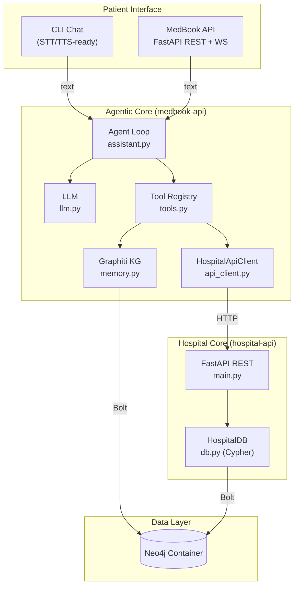
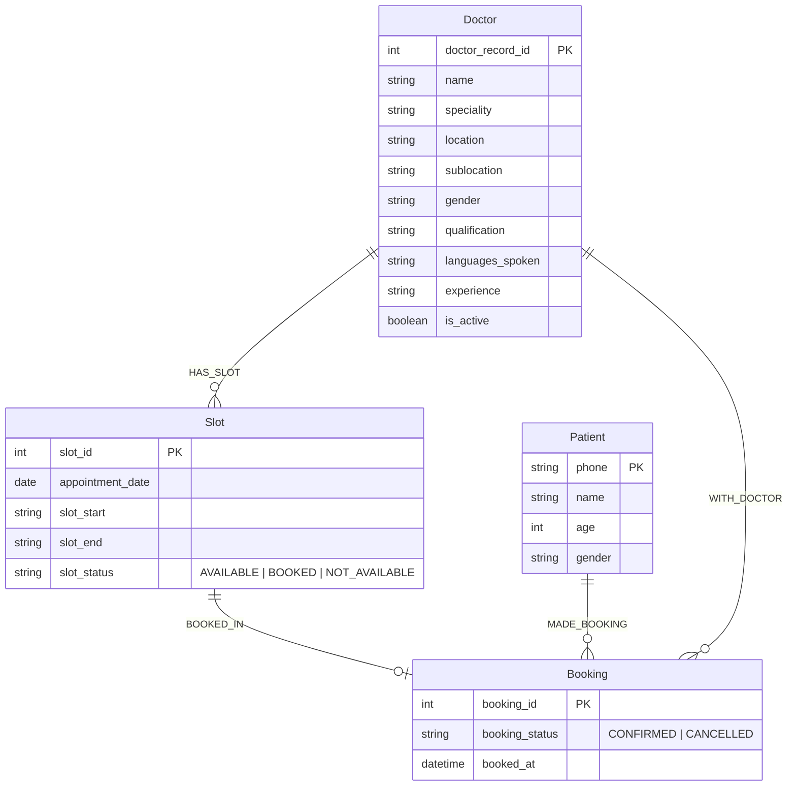

# MedBook — Agentic Doctor Appointment Booking System

This project transforms a basic Graphiti personal assistant into a **dynamic, tool-driven doctor appointment booking system**. It uses an agentic loop with OpenAI function calling, where the LLM decides which tools to invoke based on the patient's natural language input.

It demonstrates a **dual-layer architecture**:
1. **Semantic Knowledge Graph (Graphiti)**: For unstructured/semantic data like doctor profiles, symptom-to-speciality mappings, and routing rules. This allows for fuzzy, natural language matching (e.g., "my kid can't breathe" -> Pediatric Pulmonology).
2. **Transactional Data (Neo4j Cypher)**: For structured, high-concurrency data like slots, bookings, and patient records. This allows for atomic transactions to prevent double-booking.

---

## 🏗 Architecture & Flow



### How the Agent Loop Works:
1. **Receive Input**: The user types a message.
2. **LLM Decision**: The LLM evaluates the context and available tools (schemas). It decides if a tool call is needed.
3. **Execute Tools**: The dispatcher (`app/tools.py`) executes the requested tools (e.g., `search_doctors`, `suggest_speciality`, `get_available_slots`).
4. **Iterate**: The results are fed back to the LLM. It may call more tools or formulate a final text response.
5. **Respond**: The final text response is shown to the user.

---

## 🛠️ Agent Tools

The LLM has access to 11 specialized tools via OpenAI function calling:

| Tool | What it does | Key Detail |
|---|---|---|
| `identify_patient` | Look up or register a patient by phone | MERGE-based (idempotent) |
| `search_doctors` | Find doctors by speciality or name | Case-insensitive partial match |
| `suggest_speciality` | Symptom → speciality recommendation | Semantic search via Graphiti + LLM reasoning |
| `get_available_slots`| Available slots for a doctor + date | Real-time query (reflects live modifier changes) |
| `get_next_available_date`| Finds next date with open slots | Single Cypher query, avoids LLM guessing dates |
| `book_appointment` | Atomically book a slot | Single Cypher write transaction preventing double-booking |
| `get_my_bookings` | List patient's bookings | Shows confirmed + cancelled appointments |
| `reschedule_booking` | Move booking to a new slot | Atomic cancellation and rebooking in one transaction |
| `cancel_booking` | Cancel a booking, free the slot | Verifies phone ownership before cancelling |
| `record_patient_fact`| Saves long-term patient facts (allergies, preferences, relationships) | Uses Graphiti temporal memory |
| `recall_patient_history` | Retrieves a patient's historical profile | Uses Graphiti semantic recall |

---

## 🧠 Dynamic Patient Memory

MedBook uses **Graphiti** to track evolving patient health, preferences, and relationships over time. Unlike transactional data (which uses Neo4j directly), semantic facts like "I am allergic to penicillin", "I prefer evening appointments", or "I am booking for my child" are saved into the patient's individual namespace in Graphiti via explicitly controlled agent tools (`record_patient_fact`). 

When a patient connects, the agent can use `recall_patient_history` to understand their context and proactively cater to their preferences.

### Graphiti Typed Ontology

Graphiti uses a custom domain schema (`app/ontology.py`) with typed entity and edge classes so the extraction LLM produces precise, structured nodes instead of generic `Entity / relates_to` pairs:

| Entity label | What it represents |
|---|---|
| `KGPatient` | The registered patient (phone, age, gender) |
| `KGDoctor` | A named physician with a speciality |
| `KGSymptom` | A health complaint with severity/duration |
| `KGAllergy` | An allergen and reaction |
| `KGPreference` | A stated time/location/doctor preference |
| `KGFamilyMember` | A person the caller is booking for |
| `KGAppointment` | A confirmed or cancelled booking |

Edge types: `HAS_SYMPTOM`, `ALLERGIC_TO`, `PREFERS`, `BOOKED_WITH`, `GUARDIAN_OF`, `TREATS`.

> **Why the `KG` prefix?** Both the hospital-api and Graphiti write to the same Neo4j database. The hospital-api already owns `(:Doctor)`, `(:Patient)` etc. for transactional data. Prefixing Graphiti's entity labels with `KG` keeps the two layers distinct in Neo4j Browser and prevents any label confusion: `(:Entity:KGDoctor)` is always a Graphiti knowledge-graph node, while `(:Doctor)` is always a hospital-api transactional node.

---

## 🚀 Setup & Installation

### Requirements
- **Docker + Docker Compose** (for Neo4j)
- **Python 3.10+** (Virtual environment recommended)
- An API key for your chosen LLM/embedder provider (OpenAI by default)

### 1. Start Neo4j
Start the Neo4j database using Docker Compose.
```bash
docker compose up -d
```
*(Neo4j Browser will be available at http://localhost:7474)*

### 2. Install Dependencies
This project uses `uv` for fast dependency management.
```bash
uv sync
```
*(Alternatively, you can use `pip install -r requirements.txt`)*

### 3. Configure Environment
Copy the example config and fill in your settings.
```bash
cp .env.example .env
```
Edit `.env`. The minimum required field is:
```
OPENAI_API_KEY=your_sk_key_here
```

**Changing LLM or embedder provider** — both are independently configurable via env vars:
```
# LLM used by Graphiti for graph extraction (openai | anthropic | gemini | groq | ollama)
GRAPHITI_LLM_PROVIDER=openai
GRAPHITI_LLM_MODEL=gpt-4o-mini

# Embedder for vector search (openai | ollama | gemini | voyage | huggingface)
GRAPHITI_EMBEDDER_PROVIDER=openai
GRAPHITI_EMBEDDER_MODEL=text-embedding-3-small
EMBEDDING_DIM=1024
```

HuggingFace embedders (EmbeddingGemma, nomic-embed-text, BGE, etc.) require an optional install (not included by default due to the torch dependency):
```bash
pip install sentence-transformers
```
Then set `GRAPHITI_EMBEDDER_PROVIDER=huggingface` and `GRAPHITI_EMBEDDER_MODEL=<hf-repo-id>`.

> **Warning:** `EMBEDDING_DIM` is baked into the Neo4j vector index. Switching to a model with a different dimension requires wiping and rebuilding the graph.

---

## 🏥 Running the System

You have a unified entry point `main.py` that handles both database seeding and running the interactive assistant.

### Step 1: Generate Data & Start Services
First, generate the synthetic hospital data CSVs, and then start the Neo4j database and APIs using Docker Compose. The APIs must be running for the seeding process.

```bash
# Generate CSVs (only needed once or if data schema changes)
python -m scripts.generate_hospital_data

# Start Neo4j, hospital-api, and medbook-api
docker compose --profile api up -d
```
*(Neo4j Browser will be available at http://localhost:7474)*

### Step 2: Seed the Database and Knowledge Graph
With the services running, seed the Neo4j database with structural data (doctors, slots) and then build the Graphiti Knowledge Graph (which fetches data from the running `hospital-api`).

```bash
# 1. Seed Neo4j with structural hospital data (doctors, ~27K slots, bookings)
python -m hospital_api.seed

# 2. Seed Graphiti Knowledge Graph (symptom mappings, routing rules, semantic profiles)
python main.py --seed-only
```
*Note: Seeding Graphiti takes a few minutes as it makes several LLM calls to build the semantic indices.*

### Step 3: Simulate Real-World Schedule Changes (Optional)
In a separate terminal window, run the slot modifier script. This simulates real-world events by randomly blocking, walk-in booking, or reopening slots every few seconds.
```bash
python -m scripts.slot_modifier --interval 15
```
Because the assistant queries slots in real-time and uses atomic transactions for booking, it correctly handles these concurrent changes.

---

## 🧪 Verification

To ensure your database is seeded correctly and all tools function as expected, you can run the standalone verification script:

```bash
python -m scripts.smoke_test
```
This runs an end-to-end test of all 9 tools without the chat loop, verifying patient lookup, semantic search, slot querying, and atomic booking.

---

## 🧪 API Tests

Unit tests for the FastAPI endpoints are in `tests/test_api.py`. They use `pytest` and FastAPI's `TestClient`, and run **entirely offline** — no Neo4j or OpenAI connection needed (all external calls are mocked).

### Run tests
```bash
uv run pytest tests/ -v
```

### Test coverage

| Suite | Tests | What is verified |
|---|---|---|
| `TestHealth` | 2 | `/health` returns `{"status": "ok"}` with `neo4j` field |
| `TestPostChat` | 9 | Fresh session, messages array structure, valid roles, prior context passthrough, user message appended, empty message, exception handling, multi-turn growth, 422 on missing field |
| `TestWebSocketChat` | 9 | Connect + unique session ID, greeting type, send/receive reply, reset command, case-insensitive reset, multi-turn context, error type on exception, unique IDs per connection, reset-then-continue |
| `TestDocs` | 2 | Swagger UI accessible, OpenAPI schema contains expected paths |
| `TestToTts` | 17 | Markdown stripping (bold, headers, emoji, links, bullet lists), plain prose pass-through, number-to-words (times, currency ₹/$, ISO dates, phones digit-by-digit, ordinals, percent, decimals, integers), combined reply has zero raw digits |
| `TestBuildSystemPrompt` | 4 | UI mode includes markdown guidance, TTS mode includes spoken/voice guidance and forbids markdown, unknown mode falls back to UI |
| `TestPostChatTtsMode` | 4 | `response_mode=tts` strips markdown and spells digits; UI mode preserves raw reply; invalid mode defaults to UI |
| `TestWebSocketMode` | 6 | `?mode=tts` echoed in greeting, default is `ui`, TTS mode strips markdown and digits, runtime `mode:` switch command acks and takes effect, UI mode preserves raw reply |
| `TestExtractPatientPhone` | 10 | Phone discovery from tool results: found, not found, malformed JSON, None phone, scan-window limit, most-recent-wins, non-tool messages ignored, empty list, phone coerced to string |
| `TestAutoIngest` | 3 | `_schedule_auto_ingest` fired with correct phone in REST handler, not fired without phone, fired with correct phone in WS handler |
| `TestTypedRecall` | 2 | `_recall_patient_history` calls `recall_patient_facts` (not legacy `recall`); `_suggest_speciality` calls `recall_medical_knowledge` (not legacy `recall`) |

> **Note:** The one pydantic deprecation warning comes from `graphiti_core` internals — nothing to fix on your end.

### Test dependencies
Test-only deps are tracked under `[dependency-groups] dev` in `pyproject.toml` and are not installed in production:
```
pytest>=9.1.0
httpx2>=2.4.0
```

---

## 🗄️ Neo4j Data Model

The structured operational data lives as native Neo4j nodes with direct Cypher access:



*Note: The system generates ~27,000 slots representing 10-minute intervals over a 2-month period for the 11 doctors.*

Graphiti's knowledge-graph nodes coexist in the same Neo4j instance under separate labels (`KGDoctor`, `KGPatient`, `KGSymptom`, …) with the `Entity` base label. They carry Graphiti-specific properties (`uuid`, `group_id`, `name_embedding`, `summary`) and are queried exclusively via Graphiti's own APIs — they never interfere with the hospital-api's transactional queries above.

---

## 💬 Example Conversation Flow

```text
bot > Welcome to MedBook! I'm your appointment booking assistant.
      To get started, could you please share your phone number?

you > 9876543210

bot > I don't see an existing profile for this number.
      Could you tell me your name, age, and gender so I can set you up?

you > Rahul, 28, male

bot > Great, Rahul! You're all set. How can I help you today?
      You can:
      • Ask to see a specific doctor
      • Describe your symptoms and I'll suggest the right specialist
      • Check your existing appointments

you > I've been having persistent headaches and fatigue for a week

bot > Based on your symptoms, I'd recommend seeing a General Physician.
      We have Dr. Amit Sharma (22+ years experience, speaks Hindi & English).
      
      Would you like to see his available slots? If so, what date works for you?

you > Tomorrow please

bot > Here are Dr. Amit Sharma's available slots for tomorrow:
      1. 09:00 - 09:10
      2. 09:10 - 09:20
      ... 
      Which slot would you prefer?

you > 09:10 please

bot > ✅ Confirmed! Your appointment is booked:
      • Doctor: Dr. Amit Sharma (General Physician)
      • Date: June 14, 2026
      • Time: 09:10 - 09:20
      • Booking ID: 50016
```

---

## 🎙️ TTS / Voice Output Mode

MedBook supports two output modes, switchable per session without any code changes:

| Mode | Format | Best for |
|------|--------|----------|
| `ui` (default) | Rich text — markdown, emoji, formatted slot lists, raw booking IDs | Web/mobile chat UIs |
| `tts` | Plain spoken language — no markdown/emoji, every number/time/price/date spelled as words | Text-to-speech engines, voice assistants |

In TTS mode, `app/formatting.py` post-processes every reply with a deterministic sanitizer *and* the model is primed with a spoken-style system prompt, so both layers agree. Examples of what the sanitizer does:

- `6:40 PM` → "six forty PM"
- `₹500` → "five hundred rupees"
- `2026-06-20` → "June twentieth, twenty twenty-six"
- `9876543210` → "nine eight seven six …" (digit-by-digit)
- `**Confirmed!** 🏥` → "Confirmed!"

### Selecting the mode

**WebSocket** — append `?mode=tts` to the connection URL:
```bash
wscat -c "ws://localhost:8000/ws/chat?mode=tts"
```
Switch mid-conversation by sending the text command `mode: tts` or `mode: ui`.

**REST** — add `response_mode` to the request body:
```bash
curl -X POST http://localhost:8000/chat \
  -H "Content-Type: application/json" \
  -d '{"user_message": "book the 9am slot", "response_mode": "tts"}'
```

**CLI** — pass `--tts` when starting the assistant:
```bash
python -m app.assistant --tts
```

The browser tester at `/ws-test` has a UI/TTS toggle in the sidebar.

---

## 📂 Project Structure

```
.
├── app/
│   ├── api.py              # FastAPI app — REST (POST /chat) + WebSocket (/ws/chat)
│   ├── assistant.py        # Agentic tool-calling loop + CLI interface
│   ├── db.py               # Async Neo4j layer for Cypher queries (atomic bookings, slots)
│   ├── formatting.py       # Output-mode constants + to_tts() sanitizer (markdown/digit rewriting)
│   ├── llm.py              # Thin OpenAI client with function-calling support
│   ├── memory.py           # Semantic graph-memory layer (graphiti-core)
│   ├── ontology.py         # Typed Graphiti entity + edge schemas (KGPatient, KGDoctor, …)
│   ├── providers.py        # LLM + embedder factory (swap provider via .env, no code change)
│   ├── seed_hospital.py    # Seeds Graphiti KG from hospital-api (typed ontology)
│   └── tools.py            # Tool schemas + execution dispatcher (11 tools)
├── scripts/
│   ├── generate_hospital_data.py  # Generates synthetic doctor/slot CSVs
│   ├── slot_modifier.py           # Simulates real-time schedule changes
│   └── smoke_test.py              # End-to-end tool verification (no chat loop)
├── tests/
│   ├── conftest.py         # Suppresses FastAPI lifespan for offline testing
│   └── test_api.py         # 70 unit tests for REST + WebSocket endpoints + TTS sanitizer + Phase 2
├── data/
│   └── symptom_speciality_map.csv  # Symptom → speciality curated mapping
├── api_usage_guide.md      # Full API usage guide with mock conversation examples
├── docker-compose.yml      # Neo4j + optional FastAPI API service
├── Dockerfile              # Container definition for the FastAPI service
├── main.py                 # Unified entry point (seed or run CLI)
├── pyproject.toml          # Project metadata + pytest config
└── requirements.txt        # Runtime + dev dependencies
```
