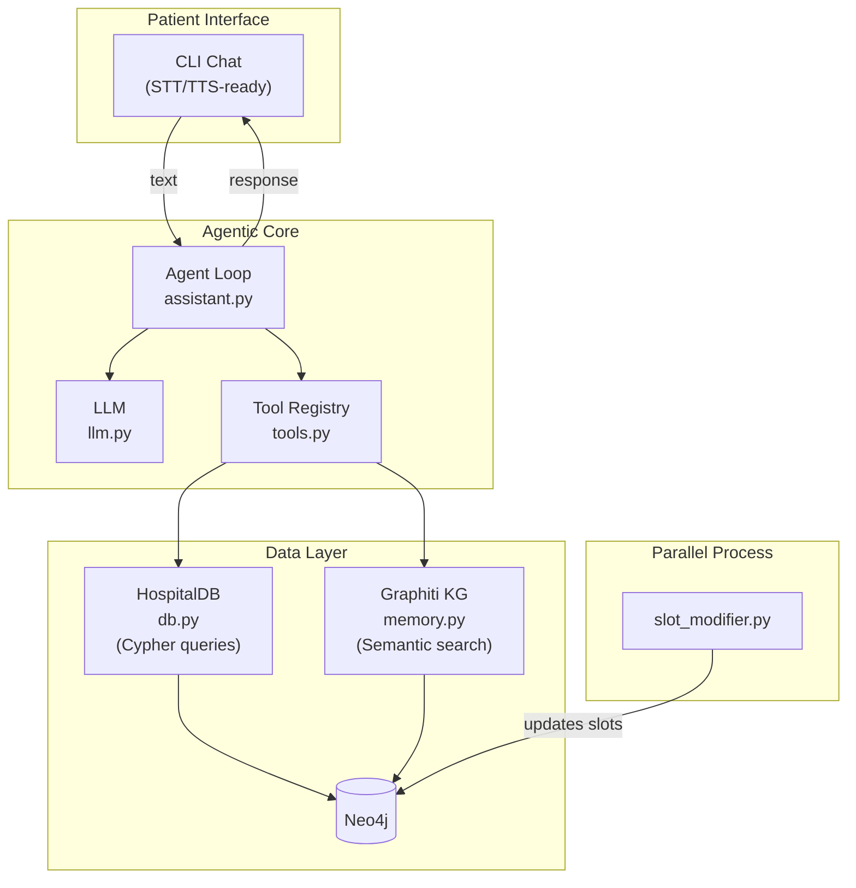
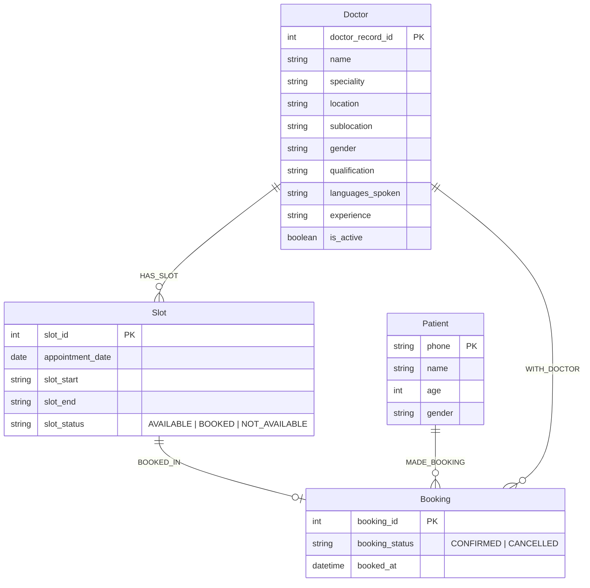

# MedBook — Agentic Doctor Appointment Booking System

This project transforms a basic Graphiti personal assistant into a **dynamic, tool-driven doctor appointment booking system**. It uses an agentic loop with OpenAI function calling, where the LLM decides which tools to invoke based on the patient's natural language input.

It demonstrates a **dual-layer architecture**:
1. **Semantic Knowledge Graph (Graphiti)**: For unstructured/semantic data like doctor profiles, symptom-to-speciality mappings, and routing rules. This allows for fuzzy, natural language matching (e.g., "my kid can't breathe" -> Pediatric Pulmonology).
2. **Transactional Data (Neo4j Cypher)**: For structured, high-concurrency data like slots, bookings, and patient records. This allows for atomic transactions to prevent double-booking.

---

## 🏗 Architecture & Flow



### How the Agent Loop Works:
1. **Receive Input**: The user types a message.
2. **LLM Decision**: The LLM evaluates the context and available tools (schemas). It decides if a tool call is needed.
3. **Execute Tools**: The dispatcher (`app/tools.py`) executes the requested tools (e.g., `search_doctors`, `suggest_speciality`, `get_available_slots`).
4. **Iterate**: The results are fed back to the LLM. It may call more tools or formulate a final text response.
5. **Respond**: The final text response is shown to the user.

---

## 🛠️ Agent Tools

The LLM has access to 7 specialized tools via OpenAI function calling:

| Tool | What it does | Key Detail |
|---|---|---|
| `identify_patient` | Look up or register a patient by phone | MERGE-based (idempotent) |
| `search_doctors` | Find doctors by speciality or name | Case-insensitive partial match |
| `suggest_speciality` | Symptom → speciality recommendation | Semantic search via Graphiti + LLM reasoning |
| `get_available_slots`| Available slots for a doctor + date | Real-time query (reflects live modifier changes) |
| `book_appointment` | Atomically book a slot | Single Cypher write transaction preventing double-booking |
| `get_my_bookings` | List patient's bookings | Shows confirmed + cancelled appointments |
| `cancel_booking` | Cancel a booking, free the slot | Verifies phone ownership before cancelling |

---

## 🚀 Setup & Installation

### Requirements
- **Docker + Docker Compose** (for Neo4j)
- **Python 3.10+** (Virtual environment recommended)
- An **OpenAI API key**

### 1. Start Neo4j
Start the Neo4j database using Docker Compose.
```bash
docker compose up -d
```
*(Neo4j Browser will be available at http://localhost:7474)*

### 2. Install Dependencies
```bash
pip install -r requirements.txt
```

### 3. Configure Environment
Copy the example config and add your OpenAI API key.
```bash
cp .env.example .env
```
Edit `.env` and set:
`OPENAI_API_KEY=your_sk_key_here`

---

## 🏥 Running the System

You have a unified entry point `main.py` that handles both database seeding and running the interactive assistant.

### Step 1: Generate Data & Seed the Database
First, generate the synthetic hospital data CSVs, and then seed the Neo4j database and Graphiti Knowledge Graph. This creates doctors, ~27K slots, symptom mappings, and routing rules.

```bash
# Generate CSVs (only needed once or if data schema changes)
python -m scripts.generate_hospital_data

# Seed Neo4j & Graphiti (clears existing data first)
python main.py --seed-only
```
*Note: Seeding takes a few minutes as it makes several LLM calls to build the Graphiti Knowledge Graph.*

### Step 2: Run the Assistant
Start the interactive CLI agent.
```bash
python main.py
```
You can chat naturally. Try describing symptoms ("My child has a fever"), asking for specific doctors ("Do you have any gynecologists?"), checking slots, and booking appointments.

### Step 3: Simulate Real-World Schedule Changes (Optional)
In a separate terminal window, run the slot modifier script. This simulates real-world events by randomly blocking, walk-in booking, or reopening slots every few seconds.
```bash
python -m scripts.slot_modifier --interval 15
```
Because the assistant queries slots in real-time and uses atomic transactions for booking, it correctly handles these concurrent changes.

---

## 🧪 Verification

To ensure your database is seeded correctly and all tools function as expected, you can run the standalone verification script:

```bash
python -m scripts.smoke_test
```
This runs an end-to-end test of all 7 tools without the chat loop, verifying patient lookup, semantic search, slot querying, and atomic booking.

---

## 🗄️ Neo4j Data Model

The structured operational data lives as native Neo4j nodes with direct Cypher access:



*Note: The system generates ~27,000 slots representing 10-minute intervals over a 2-month period for the 11 doctors.*

---

## 💬 Example Conversation Flow

```text
bot > Welcome to MedBook! I'm your appointment booking assistant.
      To get started, could you please share your phone number?

you > 9876543210

bot > I don't see an existing profile for this number.
      Could you tell me your name, age, and gender so I can set you up?

you > Rahul, 28, male

bot > Great, Rahul! You're all set. How can I help you today?
      You can:
      • Ask to see a specific doctor
      • Describe your symptoms and I'll suggest the right specialist
      • Check your existing appointments

you > I've been having persistent headaches and fatigue for a week

bot > Based on your symptoms, I'd recommend seeing a General Physician.
      We have Dr. Amit Sharma (22+ years experience, speaks Hindi & English).
      
      Would you like to see his available slots? If so, what date works for you?

you > Tomorrow please

bot > Here are Dr. Amit Sharma's available slots for tomorrow:
      1. 09:00 - 09:10
      2. 09:10 - 09:20
      ... 
      Which slot would you prefer?

you > 09:10 please

bot > ✅ Confirmed! Your appointment is booked:
      • Doctor: Dr. Amit Sharma (General Physician)
      • Date: June 14, 2026
      • Time: 09:10 - 09:20
      • Booking ID: 50016
```

---

## 🎙️ STT/TTS Readiness

The architecture is designed so the chat interface is a thin, decoupled layer. The agent core (`tools.py`, `db.py`, `assistant.py` agent loop) only processes and returns strings. 

This means you can easily swap the CLI `input()` and `print()` statements with Speech-to-Text (STT) and Text-to-Speech (TTS) modules to create a voice-driven phone assistant, without changing any of the agent logic or conversation history tracking.

---

## 📂 Project Structure

- `app/assistant.py` - The agentic tool-calling loop and CLI interface.
- `app/db.py` - Async Neo4j access layer handling transactional Cypher queries (atomic bookings, slot queries, etc.).
- `app/llm.py` - Minimal OpenAI client wrapped with function-calling support.
- `app/memory.py` - The semantic graph-memory layer over `graphiti-core`.
- `app/seed_hospital.py` - Script to clear the DB, load structured CSV data, and seed Graphiti.
- `app/tools.py` - OpenAI function-calling tool definitions and the execution dispatcher.
- `scripts/generate_hospital_data.py` - Generates synthetic slots and bookings CSVs.
- `scripts/slot_modifier.py` - Parallel script simulating real-time schedule changes.
- `scripts/smoke_test.py` - Automated tool verification tests.
- `data/symptom_speciality_map.csv` - Curated mapping of symptoms to medical specialities.
