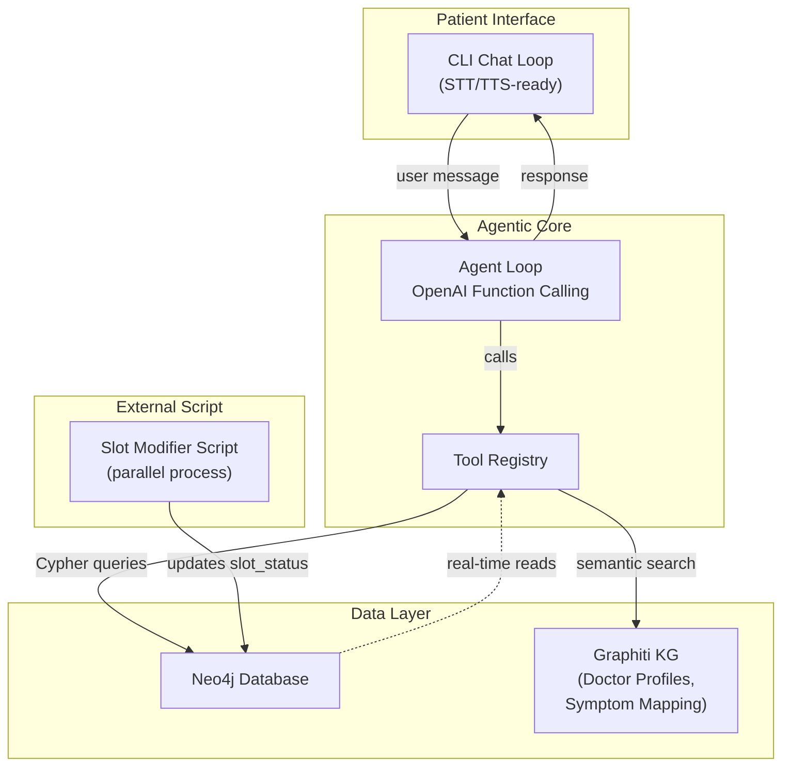

# Doctor Slot Booking — Dynamic Agentic System

Transform the existing Graphiti personal assistant into a **dynamic, tool-driven doctor appointment booking system** that queries Neo4j in real-time, adapts to slot changes, and supports multi-patient concurrent access.

## Current State

The existing codebase is a personal assistant that:
- Uses **Graphiti** to build a temporal knowledge graph from free-text conversation
- Stores everything in **Neo4j** (docker-compose, `bolt://localhost:7687`)
- Has a simple **recall → generate → remember** loop in [assistant.py](file:///c:/Users/Him-Asus/Documents/graphiti-personal-assistant/app/assistant.py)
- Uses a thin OpenAI wrapper in [llm.py](file:///c:/Users/Him-Asus/Documents/graphiti-personal-assistant/app/llm.py)
- Has CSV data: [doctor_directory.csv](file:///c:/Users/Him-Asus/Documents/graphiti-personal-assistant/data/doctor_directory.csv) (11 doctors), [doctor_slot_availability.csv](file:///c:/Users/Him-Asus/Documents/graphiti-personal-assistant/data/doctor_slot_availability.csv) (~27K slots, 10-min intervals, 2 months), [appointment_booking.csv](file:///c:/Users/Him-Asus/Documents/graphiti-personal-assistant/data/appointment_booking.csv) (16 bookings)

---

## High-Level Architecture



---

## User Review Required

> [!IMPORTANT]
> **Graphiti's Role Changes Significantly.** In the current codebase, Graphiti is the *only* data store and handles all memory. In this new design, Graphiti is used **alongside** direct Neo4j Cypher queries:
> - **Graphiti** → stores doctor profiles, symptom-to-speciality mappings, and conversation memory (semantic/temporal knowledge graph)
> - **Direct Neo4j (via `neo4j` Python driver)** → stores and queries structured operational data (slots, bookings, patients) using Cypher, because slot availability is transactional/real-time data that needs atomic updates, not LLM-extracted knowledge
>
> This is a **dual-layer** approach. Let me know if you'd prefer a different split.

> [!IMPORTANT]
> **Existing Neo4j Data Will Be Cleared.** The plan includes a `seed_hospital.py` script that wipes the Neo4j database and loads the hospital data fresh. This is per your requirement to "clear the existing Neo4j data."

> [!WARNING]
> **OpenAI Function Calling is Required.** The agentic tool-driven design uses OpenAI's function calling (`tools` parameter). This requires `gpt-4o` or `gpt-4o-mini` (which you already use). Each user turn may result in **multiple LLM calls** (one per tool invocation), so API costs will be higher than the current single-call design.

---

## Open Questions — ✅ All Resolved

> [!NOTE]
> **Patient Registration Flow — RESOLVED:** Pre-seed patients from `appointment_booking.csv`, and also allow new patients to register conversationally on first interaction (phone → name/age/gender).

> [!NOTE]
> **Concurrent Booking Conflicts — RESOLVED:** Use atomic Neo4j transactions (check status + book in one Cypher query). If implementation issues arise, fall back to check-then-retry with user-friendly messaging.

> [!NOTE]
> **Symptom Mapping — RESOLVED:** Curated mapping table seeded into Graphiti, plus LLM reasoning over doctor profile facts as a fallback for ambiguous/unmatched symptoms.

---

## Proposed Changes

### Component 1: Neo4j Data Model

The structured data (slots, bookings, patients) lives as native Neo4j nodes with direct Cypher access. Graphiti nodes (doctor profiles, symptom mappings) coexist in the same database.

```mermaid
erDiagram
    Doctor {
        int doctor_record_id PK
        string name
        string speciality
        string location
        string sublocation
        string gender
        string qualification
        string languages_spoken
        string experience
        boolean is_active
    }
    Slot {
        int slot_id PK
        date appointment_date
        string slot_start
        string slot_end
        string slot_status "AVAILABLE | BOOKED | NOT_AVAILABLE"
    }
    Patient {
        string phone PK
        string name
        int age
        string gender
    }
    Booking {
        int booking_id PK
        string booking_status "CONFIRMED | CANCELLED"
        datetime booked_at
    }

    Doctor ||--o{ Slot : "HAS_SLOT"
    Slot ||--o| Booking : "BOOKED_IN"
    Patient ||--o{ Booking : "MADE_BOOKING"
    Booking }o--|| Doctor : "WITH_DOCTOR"
```



**Key design decisions:**
- `slot_status` has 3 values: `AVAILABLE`, `BOOKED`, `NOT_AVAILABLE` (for admin-blocked slots)
- Patient identified by phone number (unique key)
- Booking links Patient → Slot → Doctor with timestamps

---

### Component 2: Data Generation Enhancement

#### [MODIFY] [generate_hospital_data.py](file:///c:/Users/Him-Asus/Documents/graphiti-personal-assistant/scripts/generate_hospital_data.py)

Add patient demographic fields and richer booking data:

- Add `patient_age` and `patient_gender` columns to `appointment_booking.csv`
- Add age-range generation (random 1–80)
- Add gender generation tied to patient names
- Add `NOT_AVAILABLE` as a possible slot status (for admin-blocked slots, ~2% weight)
- Add a `symptom_speciality_map.csv` output that maps symptoms → specialities (used for Graphiti seeding)
- Fix the `doctor_record_id` column — currently the script overwrites `doctor_record_id` with `range(1, len+1)` which breaks the actual IDs from the CSV (IDs are 1,2,3,4,5,19,35,41,58,65,69)

**New CSV outputs:**
1. `doctor_slot_availability.csv` — unchanged schema + `NOT_AVAILABLE` status
2. `appointment_booking.csv` — adds `patient_age`, `patient_gender` columns
3. `symptom_speciality_map.csv` — **[NEW]** maps symptoms/conditions to specialities

---

### Component 3: Neo4j Data Loader

#### [NEW] [seed_hospital.py](file:///c:/Users/Him-Asus/Documents/graphiti-personal-assistant/app/seed_hospital.py)

Replaces `seed_demo.py` as the data seeding entry point. This script:

1. **Clears all existing Neo4j data** (both native nodes and Graphiti nodes)
2. **Loads structured data** via direct Cypher:
   - Creates `:Doctor` nodes from `doctor_directory.csv`
   - Creates `:Slot` nodes from `doctor_slot_availability.csv` with `(:Doctor)-[:HAS_SLOT]->(:Slot)` relationships
   - Creates `:Patient` nodes and `:Booking` nodes from `appointment_booking.csv` with proper relationships
3. **Seeds Graphiti knowledge graph** with:
   - Doctor profile episodes (one per doctor — name, speciality, qualifications, languages, experience)
   - Symptom-to-speciality mapping episodes (e.g., "For menstrual problems, irregular periods, pregnancy care → consult a Gynecology specialist")
   - Age-based routing rules (e.g., "Children under 14 should see a General Pediatrics specialist")
4. **Creates Neo4j indexes** for fast Cypher lookups:
   - `CREATE INDEX ON :Doctor(doctor_record_id)`
   - `CREATE INDEX ON :Doctor(speciality)`
   - `CREATE INDEX ON :Slot(slot_id)`
   - `CREATE INDEX ON :Slot(slot_status)`
   - `CREATE INDEX ON :Patient(phone)`
   - `CREATE INDEX ON :Booking(booking_id)`

**Usage:** `python -m app.seed_hospital`

---

### Component 4: Neo4j Database Access Layer

#### [NEW] [db.py](file:///c:/Users/Him-Asus/Documents/graphiti-personal-assistant/app/db.py)

A thin async wrapper around the `neo4j` Python driver for executing Cypher queries. Separate from Graphiti because structured slot/booking operations need atomic transactions, not LLM-based extraction.

Key methods:
```python
class HospitalDB:
    async def find_doctors_by_speciality(speciality: str) -> list[dict]
    async def find_doctor_by_name(name: str) -> list[dict]
    async def get_available_slots(doctor_id: int, date: str) -> list[dict]
    async def book_slot(slot_id: int, patient_phone: str, patient_name: str) -> dict  # atomic
    async def get_patient_bookings(phone: str) -> list[dict]
    async def register_patient(phone: str, name: str, age: int, gender: str) -> dict
    async def get_patient(phone: str) -> dict | None
    async def cancel_booking(booking_id: int, patient_phone: str) -> bool
    async def get_all_specialities() -> list[str]
```

The `book_slot` method uses an **atomic Cypher transaction** to prevent double-booking:
```cypher
MATCH (s:Slot {slot_id: $slot_id})
WHERE s.slot_status = 'AVAILABLE'
SET s.slot_status = 'BOOKED'
CREATE (b:Booking {booking_id: ..., booking_status: 'CONFIRMED', booked_at: datetime()})
CREATE (p)-[:MADE_BOOKING]->(b)
CREATE (b)-[:BOOKED_IN]->(s)
...
RETURN b
```
If the `WHERE` clause fails (slot was changed to BOOKED/NOT_AVAILABLE by the modifier script), the transaction returns nothing and the agent tells the patient the slot is no longer available.

---

### Component 5: Agent Tools

#### [NEW] [tools.py](file:///c:/Users/Him-Asus/Documents/graphiti-personal-assistant/app/tools.py)

Defines the OpenAI function-calling tool schemas and their implementations. Each tool maps to a `HospitalDB` method or a Graphiti search.

| Tool Name | Purpose | Inputs |
|---|---|---|
| `identify_patient` | Look up or register a patient by phone | `phone`, optionally `name`, `age`, `gender` |
| `search_doctors_by_speciality` | Find active doctors for a speciality | `speciality` |
| `search_doctors_by_name` | Find a doctor by name (partial match) | `name` |
| `suggest_speciality` | Given symptoms/age/gender, suggest the right speciality | `symptoms`, `age`, `gender` |
| `get_available_slots` | List available slots for a doctor on a date | `doctor_record_id`, `date` |
| `book_appointment` | Book a specific slot for a patient | `slot_id`, `patient_phone` |
| `get_my_bookings` | List a patient's existing bookings | `patient_phone` |
| `cancel_booking` | Cancel an existing booking | `booking_id`, `patient_phone` |

The `suggest_speciality` tool uses **Graphiti's semantic search** (`memory.recall()`) to find relevant symptom-to-speciality mappings and doctor profiles, then returns matched specialities. This is where the knowledge graph shines — the LLM-extracted relationships between symptoms, conditions, and specialities enable fuzzy matching that a keyword lookup can't.

---

### Component 6: Agentic Assistant

#### [MODIFY] [assistant.py](file:///c:/Users/Him-Asus/Documents/graphiti-personal-assistant/app/assistant.py)

Complete rewrite of the chat loop to use an **agentic tool-calling pattern**:

```
Patient message
      │
      ▼
┌─────────────────────────────┐
│  Agent Loop (max N iters)   │
│                             │
│  1. Send message + tools    │
│     to OpenAI               │
│  2. If response has tool    │
│     calls → execute them,   │◄──── loop
│     append results, go to 1 │
│  3. If response is text     │
│     → return to patient     │
└─────────────────────────────┘
```

**System prompt** changes to a hospital booking assistant persona:
- Greets the patient, asks for phone number first
- Uses tools to look up patient, find doctors, check slots, book appointments
- Adapts suggestions based on age (children → pediatrics), gender, symptoms
- Confirms bookings with slot details
- Handles slot-unavailable gracefully ("that slot was just taken, here are alternatives")

**Conversation history** is maintained in-memory for multi-turn context (the current code is stateless per-turn — each message is independent). The agent needs to remember:
- Which patient is currently chatting (phone → name → demographics)
- What doctor/speciality they've been discussing
- Which slots were shown

#### [MODIFY] [llm.py](file:///c:/Users/Him-Asus/Documents/graphiti-personal-assistant/app/llm.py)

Extend to support OpenAI function calling:
```python
class LLM:
    def chat_with_tools(self, messages: list[dict], tools: list[dict]) -> ChatCompletion:
        """Single completion call with tool definitions. Returns the raw
        ChatCompletion so the agent loop can inspect tool_calls."""
```

#### [MODIFY] [memory.py](file:///c:/Users/Him-Asus/Documents/graphiti-personal-assistant/app/memory.py)

Keep the existing `GraphMemory` class mostly intact. Changes:
- Add a `group_id` of `"hospital"` for doctor/symptom data (separate from per-patient conversation memory)
- The `recall` method is used by the `suggest_speciality` tool to semantically search doctor profiles and symptom mappings
- Optionally, after each successful booking, `remember()` the interaction so the knowledge graph captures booking patterns (useful for future analytics, but not critical for MVP)

---

### Component 7: Slot Modifier Script

#### [NEW] [slot_modifier.py](file:///c:/Users/Him-Asus/Documents/graphiti-personal-assistant/scripts/slot_modifier.py)

A standalone script that runs in parallel and modifies slot statuses directly in Neo4j. Simulates real-world events: a doctor's schedule changes, admin blocks slots, walk-in patients book slots from another system.

**Usage:** `python -m scripts.slot_modifier`

**Behavior:**
- Connects to Neo4j via the `neo4j` driver (same connection as the main app)
- Runs in a loop with a configurable interval (e.g., every 30 seconds)
- Each iteration randomly performs one of:
  - Mark 1–3 random `AVAILABLE` slots as `NOT_AVAILABLE` (doctor break, emergency)
  - Mark 1–2 random `AVAILABLE` slots as `BOOKED` (walk-in booking)
  - Mark 1 random `NOT_AVAILABLE` slot back to `AVAILABLE` (schedule reopened)
- Prints what it changed so you can see it happening
- The main agent app reads slot status at query time, so these changes are **immediately reflected** in the next tool call

**Why this matters:** If a patient asks "show me slots for Dr. Asha Mehta tomorrow" and while they're deciding, the modifier script marks one of those slots as `NOT_AVAILABLE`, the subsequent `book_appointment` tool call will fail gracefully and offer alternatives.

---

### Component 8: Enhanced Data Generation

#### [NEW] [symptom_speciality_map.csv](file:///c:/Users/Him-Asus/Documents/graphiti-personal-assistant/data/symptom_speciality_map.csv)

A curated mapping for the 7 specialities in the doctor directory:

| speciality | symptoms_keywords | age_group | gender_relevance |
|---|---|---|---|
| Gynecology | menstrual, periods, pregnancy, PCOS, fertility, ovarian, uterine, prenatal | 12+ | Female |
| General Pediatrics | child fever, growth, vaccination, child development, infant care | 0-14 | Any |
| General Physician | fever, cold, cough, headache, fatigue, body pain, general checkup | Any | Any |
| Fetal Medicine & Ultrasonography | fetal scan, anomaly scan, high-risk pregnancy, ultrasound | Any | Female |
| Pediatric Intensive Care Unit (PICU) | child emergency, breathing difficulty in child, critical care child | 0-14 | Any |
| Pediatric Pulmonology | child asthma, child breathing, wheezing, child lung | 0-14 | Any |
| Pediatric Gastroenterology & Hepat | child stomach, child digestion, liver child, jaundice child | 0-14 | Any |

---

### Component 9: Configuration & Dependencies

#### [MODIFY] [requirements.txt](file:///c:/Users/Him-Asus/Documents/graphiti-personal-assistant/requirements.txt)

Add:
```
neo4j>=5.0.0          # Direct Cypher access for structured data
```

#### [MODIFY] [pyproject.toml](file:///c:/Users/Him-Asus/Documents/graphiti-personal-assistant/pyproject.toml)

Add `neo4j` dependency.

#### [MODIFY] [.env.example](file:///c:/Users/Him-Asus/Documents/graphiti-personal-assistant/.env.example)

No changes needed — existing Neo4j credentials are reused.

#### [MODIFY] [main.py](file:///c:/Users/Him-Asus/Documents/graphiti-personal-assistant/main.py)

Update to be the main entry point that:
1. Seeds the database (if `--seed` flag passed)
2. Runs the interactive booking assistant

---

### Summary of All Files

| File | Action | Purpose |
|---|---|---|
| `app/assistant.py` | MODIFY | Agentic tool-calling booking loop |
| `app/llm.py` | MODIFY | Add function-calling support |
| `app/memory.py` | MODIFY | Add hospital group_id, keep recall for symptom search |
| `app/db.py` | NEW | Neo4j Cypher access layer for slots/bookings/patients |
| `app/tools.py` | NEW | Tool definitions and implementations |
| `app/seed_hospital.py` | NEW | Clear DB + load CSV data + seed Graphiti KG |
| `scripts/slot_modifier.py` | NEW | Parallel script to change slot statuses |
| `scripts/generate_hospital_data.py` | MODIFY | Add age/gender fields, symptom map, fix IDs |
| `data/symptom_speciality_map.csv` | NEW | Symptom → speciality mapping table |
| `requirements.txt` | MODIFY | Add `neo4j` driver |
| `pyproject.toml` | MODIFY | Add `neo4j` dependency |
| `main.py` | MODIFY | Updated entry point |

---

## Example Conversation Flow

```
bot > Welcome to MedBook! I'm your appointment booking assistant.
      To get started, could you please share your phone number?

you > 9876543210

bot > I don't see an existing profile for this number.
      Could you tell me your name, age, and gender so I can set you up?

you > Rahul, 28, male

bot > Great, Rahul! You're all set. How can I help you today?
      You can:
      • Ask to see a specific doctor
      • Describe your symptoms and I'll suggest the right specialist
      • Check your existing appointments

you > I've been having persistent headaches and fatigue for a week

bot > Based on your symptoms, I'd recommend seeing a General Physician.
      We have Dr. Amit Sharma (22+ years experience, speaks Hindi & English).
      
      Would you like to see his available slots? If so, what date works for you?

you > Tomorrow please

bot > Here are Dr. Amit Sharma's available slots for June 14:
      1. 09:00 - 09:10
      2. 09:10 - 09:20
      3. 09:20 - 09:30
      ... (showing first 5 of 42 available)
      
      Which slot would you prefer?

you > 09:30 please

bot > ✅ Confirmed! Your appointment is booked:
      • Doctor: Dr. Amit Sharma (General Physician)
      • Date: June 14, 2026
      • Time: 09:30 - 09:40
      • Booking ID: 50016
      
      Is there anything else I can help with?
```

**Meanwhile, the slot_modifier script runs:**
```
[slot_modifier] Marked slot 100035 (Dr. Asha Mehta, Jun 14 14:40-14:50) as NOT_AVAILABLE
[slot_modifier] Marked slot 100289 (Dr. Rajesh Kumar, Jun 13 09:00-09:10) as BOOKED
```

If a patient tries to book slot 100035, the agent will say:
```
bot > I'm sorry, that slot is no longer available. Let me show you 
      other available times for Dr. Asha Mehta on June 14...
```

---

## STT/TTS Readiness

The architecture is designed so the chat interface is a thin layer:

```python
# Current: CLI text input/output
user_message = input("you > ")
print(f"bot > {reply}")

# Future: swap with STT/TTS
user_message = stt_module.transcribe(audio_stream)  
tts_module.speak(reply)
```

The agent core (`tools.py`, `db.py`, `assistant.py` agent loop) doesn't care whether input comes from text or speech — it just processes strings. The conversation history tracking also supports this (no re-architecture needed).

---

## Verification Plan

### Automated Tests

```bash
# 1. Generate fresh data
python -m scripts.generate_hospital_data

# 2. Seed Neo4j (requires docker compose up)
python -m app.seed_hospital

# 3. Verify data loaded
# Open http://localhost:7474 and run:
#   MATCH (d:Doctor) RETURN d.name, d.speciality — should show 11 doctors
#   MATCH (s:Slot) RETURN count(s) — should show ~27K slots
#   MATCH (p:Patient) RETURN p — should show seeded patients
```

### Manual Verification

1. **Happy path:** Run the assistant, register as a new patient, search by symptom, book a slot — confirm booking appears in Neo4j
2. **Concurrent modification:** Run `slot_modifier.py` in a second terminal, attempt to book a slot that gets modified — confirm graceful handling
3. **Age-based routing:** Register as a 5-year-old, describe symptoms → confirm pediatric specialist is suggested
4. **Gender-based routing:** Register as female, mention pregnancy symptoms → confirm Gynecology/Fetal Medicine suggested
5. **Doctor name search:** Ask for "Dr. Rajesh" → confirm partial match works
6. **Multiple patients:** Open two terminal sessions with different phone numbers — confirm isolated booking experiences
7. **Booking history:** After booking, ask "show my appointments" → confirm listing works
